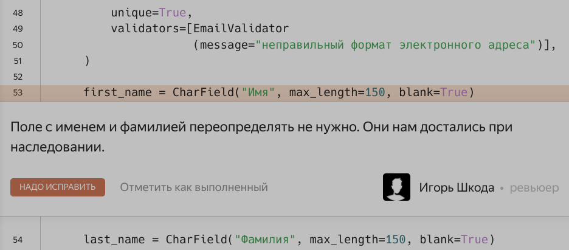
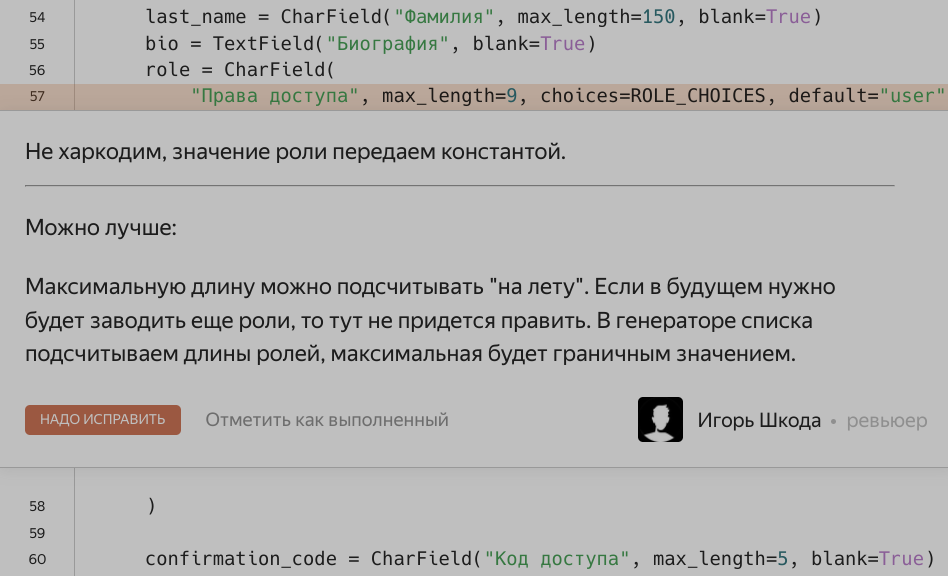
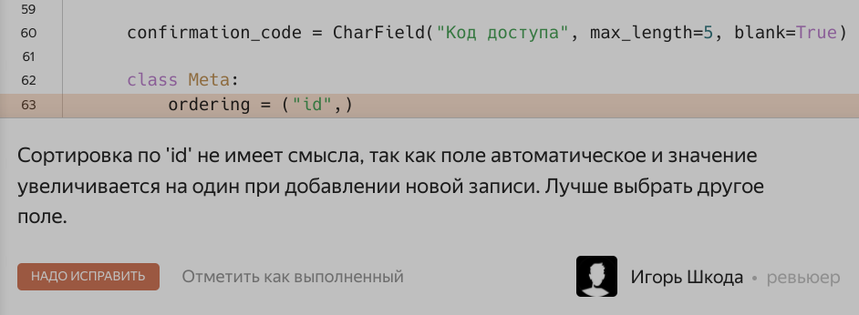
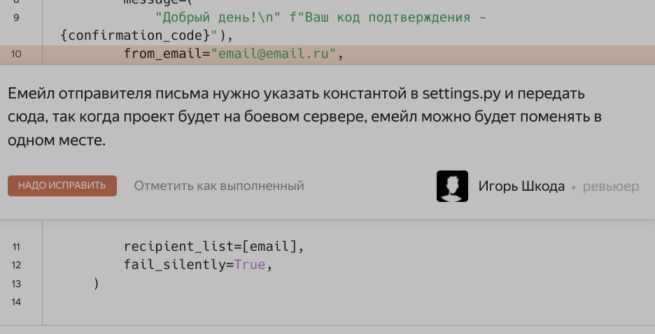
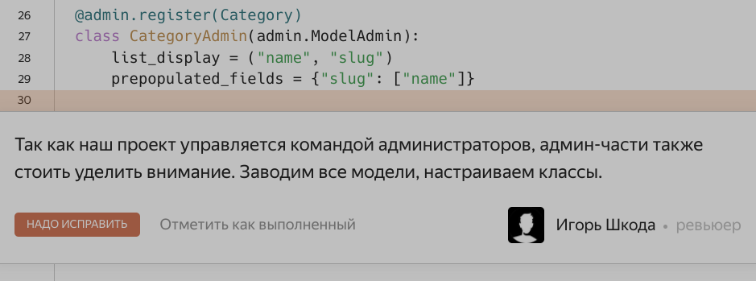
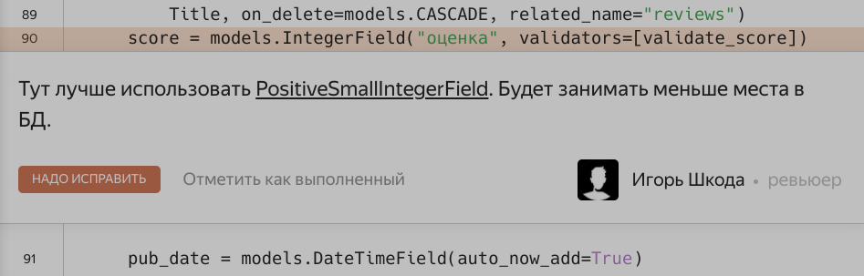

 Дмитрий

 Станислав

 Алексей

## []api

[]__init__.py  Алексей

### []permissions.py

[]  Алексей

[]  Алексей

[]  Алексей

[]  Алексей

https://www.django-rest-framework.org/api-guide/permissions/#isauthenticatedorreadonly

[]  Алексей

### []serializers.py

[v]  Станислав

[v]  Станислав

https://djangodoc.ru/3.2/ref/models/querysets/#annotate

[v]  Станислав

[v]  Станислав

[v]  Станислав

[]  Алексей

[]  Алексей

[]  Алексей

[]  Алексей

### []urls.py

[]  Алексей

[]  Алексей

### []views.py

[v]  Станислав

[v]  Станислав

[v]  Станислав

[v]  Станислав

[v]  Станислав

https://www.django-rest-framework.org/api-guide/filtering/#orderingfilter

[v]  Станислав

[v]  Станислав

[v]  Станислав

[v]  Станислав

[]  Алексей

[]  Алексей

## []api_yamdb

### []settings.py

[]  Алексей

### []urls.py

[]  Алексей

[]  Алексей

## []custom_users 

### []__init__.py  Дмитрий

### []admin.py  Дмитрий

### []apps.py  Дмитрий

### []models.py

[]  Дмитрий

[]  Дмитрий

[]  Дмитрий

[]  Дмитрий

[]  Дмитрий

[]  Дмитрий

[]  Дмитрий

[]  Дмитрий

[]  Дмитрий

[]  Дмитрий

[]  Дмитрий

### []permissions.py  Дмитрий

### []serializers.py

[]  Дмитрий

https://stackoverflow.com/questions/46234627/how-does-default-token-generator-store-tokens

[]  Дмитрий

https://www.digitalocean.com/community/tutorials/python-super#python-3-super

[]  Дмитрий

[]  Дмитрий

https://stackoverflow.com/questions/46234627/how-does-default-token-generator-store-tokens

[]  Дмитрий

[]  Дмитрий

[]  Дмитрий

### []urls.py  Дмитрий

### []utils.py  Дмитрий

### []views.py

[]  Дмитрий

https://peps.python.org/pep-0257/#multi-line-docstrings

https://pythonist.ru/docstrings-dokumentirovanie-koda-v-python/

[]  Дмитрий

[]  Дмитрий

[]  Дмитрий

[]  Дмитрий

## []reviews

### []admin.py  Дмитрий

### []models.py

[]  Алексей

[]  Алексей

[]  Алексей

[]  Алексей

[]  Алексей

[]  Алексей

https://docs.djangoproject.com/en/5.0/ref/models/fields/#smallintegerfield

[]  Алексей

[]  Алексей

[]  Алексей

https://docs.djangoproject.com/en/2.2/ref/models/fields/#positivesmallintegerfield

[]  Алексей

https://ru.hexlet.io/blog/posts/magic-numbers

[]  Алексей

https://ru.hexlet.io/blog/posts/magic-numbers

[]  Алексей

https://docs.djangoproject.com/en/dev/internals/contributing/writing-code/coding-style/#model-style

[]  Алексей

### []validators.py

[]  Алексей

[]  Алексей

## []import_csv.py

[v]  Станислав

[v]  Станислав

[v]  Станислав

## []README.md

[]  Алексей

[]  Алексей

https://texterra.ru/blog/ischerpyvayushchaya-shpargalka-po-sintaksisu-razmetki-markdown-na-zametku-avtoram-veb-razrabotchikam.html

https://dillinger.io/

